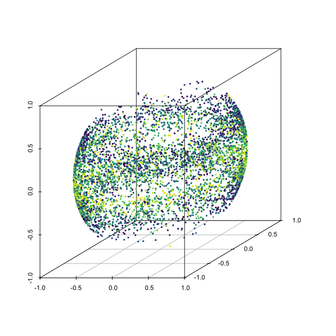

# rotasym

[](https://www.gnu.org/licenses/gpl-3.0)
[](https://github.com/egarpor/rotasym/actions)
[](https://cran.r-project.org/package=rotasym)
[](https://cran.r-project.org/package=rotasym)
[](https://cran.r-project.org/package=rotasym)

<!--  -->

## Overview

Software companion for the paper “*On optimal tests for rotational
symmetry against new classes of hyperspherical distributions*”
(García-Portugués, Paindaveine and Verdebout, 2020). It implements the
proposed tests for rotational symmetry of hyperspherical data and allows
to replicate the data application presented.

## Installation

Get the released version from CRAN:

``` r
# Install the package
install.packages("rotasym")

# Load package
library(rotasym)
```

Alternatively, get the latest version from GitHub:

``` r
# Install the package
library(devtools)
install_github("egarpor/rotasym")

# Load package
library(rotasym)
```

## Tests usage

The following are some simple examples of the usage of the main function
of the package, `test_rotasym`, with simulated data. More examples are
available in `?test_rotasym`.

``` r
# Sample data from a vMF (rotational symmetric distribution about mu)
n <- 200
p <- 10
theta <- c(1, rep(0, p - 1))
set.seed(123456789)
data_0 <- r_vMF(n = n, mu = theta, kappa = 1)
```

### Specified-θ case

``` r
# theta known
test_rotasym(data = data_0, theta = theta, type = "sc")
#> 
#>  Scatter test for rotational symmetry
#> 
#> data:  data_0
#> Q_sc = 35.013, df = 44, p-value = 0.8315
test_rotasym(data = data_0, theta = theta, type = "loc_vMF")
#> 
#>  Location vMF test for rotational symmetry
#> 
#> data:  data_0
#> Q_loc_vMF = 11.316, df = 9, p-value = 0.2547
test_rotasym(data = data_0, theta = theta, type = "hyb_vMF")
#> 
#>  Hybrid vMF test (addition of statistics) for rotational symmetry
#> 
#> data:  data_0
#> Q_hyb_vMF = 46.329, df = 53, p-value = 0.7297
```

### Unspecified-θ case

``` r
# theta unknown (employs the spherical mean as estimator)
test_rotasym(data = data_0, type = "sc")
#> 
#>  Scatter test for rotational symmetry
#> 
#> data:  data_0
#> Q_sc = 36.568, df = 44, p-value = 0.7793
test_rotasym(data = data_0, type = "loc_vMF")
#> 
#>  Location vMF test for rotational symmetry
#> 
#> data:  data_0
#> Q_loc_vMF = 12.335, df = 9, p-value = 0.1951
test_rotasym(data = data_0, type = "hyb_vMF")
#> 
#>  Hybrid vMF test (addition of statistics) for rotational symmetry
#> 
#> data:  data_0
#> Q_hyb_vMF = 48.902, df = 53, p-value = 0.6344
```

## Data application: test for the rotational symmetry of sunspots

The data application in García-Portugués, Paindaveine and Verdebout
(2020) can be replicated through the script
[sunspots-births.R](https://github.com/egarpor/rotasym/blob/master/data-raw/sunspots-births.R)
(data gathering and preprocessing) and the code snippet below.

``` r
# Load data
data("sunspots_births")
sunspots_births$X <-
  cbind(cos(sunspots_births$phi) * cos(sunspots_births$theta),
        cos(sunspots_births$phi) * sin(sunspots_births$theta),
        sin(sunspots_births$phi))

# Test rotational symmetry for the 23rd cycle
sunspots_23 <- subset(sunspots_births, cycle == 23)
test_rotasym(data = sunspots_23$X, type = "sc", theta = c(0, 0, 1))
#> 
#>  Scatter test for rotational symmetry
#> 
#> data:  sunspots_23$X
#> Q_sc = 3.5964, df = 2, p-value = 0.1656
test_rotasym(data = sunspots_23$X, type = "loc", theta = c(0, 0, 1))
#> 
#>  Location test for rotational symmetry
#> 
#> data:  sunspots_23$X
#> Q_loc = 1.5657, df = 2, p-value = 0.4571
test_rotasym(data = sunspots_23$X, type = "hyb", theta = c(0, 0, 1))
#> 
#>  Hybrid test (addition of statistics) for rotational symmetry
#> 
#> data:  sunspots_23$X
#> Q_hyb = 5.1622, df = 4, p-value = 0.2711

# Test rotational symmetry for the 22nd cycle
sunspots_22 <- subset(sunspots_births, cycle == 22)
test_rotasym(data = sunspots_22$X, type = "sc", theta = c(0, 0, 1))
#> 
#>  Scatter test for rotational symmetry
#> 
#> data:  sunspots_22$X
#> Q_sc = 4.4577, df = 2, p-value = 0.1077
test_rotasym(data = sunspots_22$X, type = "loc", theta = c(0, 0, 1))
#> 
#>  Location test for rotational symmetry
#> 
#> data:  sunspots_22$X
#> Q_loc = 8.7579, df = 2, p-value = 0.01254
test_rotasym(data = sunspots_22$X, type = "hyb", theta = c(0, 0, 1))
#> 
#>  Hybrid test (addition of statistics) for rotational symmetry
#> 
#> data:  sunspots_22$X
#> Q_hyb = 13.216, df = 4, p-value = 0.01027

# More analyses in ?sunspots_births
example("sunspots_births")
#> 
#> snspt_> # Load births data of the 23rd cycle
#> snspt_> data("sunspots_births")
#> 
#> snspt_> sp_bir_23 <- subset(sunspots_births, cycle == 23)
#> 
#> snspt_> # Transform to Cartesian coordinates
#> snspt_> sp_bir_23$X_bir <-
#> snspt_+   cbind(cos(sp_bir_23$phi) * cos(sp_bir_23$theta),
#> snspt_+         cos(sp_bir_23$phi) * sin(sp_bir_23$theta),
#> snspt_+         sin(sp_bir_23$phi))
#> 
#> snspt_> # Plot births
#> snspt_> n <- nrow(sp_bir_23)
#> 
#> snspt_> if (requireNamespace("rgl")) {
#> snspt_+   rgl::plot3d(0, 0, 0, xlim = c(-1, 1), ylim = c(-1, 1), zlim = c(-1, 1),
#> snspt_+               radius = 1, type = "s", col = "lightblue", alpha = 0.25,
#> snspt_+               lit = FALSE)
#> snspt_+   n_cols <- 100
#> snspt_+   cuts <- cut(x = sp_bir_23$date, include.lowest = TRUE,
#> snspt_+               breaks = quantile(sp_bir_23$date,
#> snspt_+                                 probs = seq(0, 1, l = n_cols + 1)))
#> snspt_+   rgl::points3d(sp_bir_23$X_bir, col = viridisLite::viridis(n_cols)[cuts])
#> snspt_+ }
#> 
#> snspt_> # Spörer's law: sunspots at the beginning of the solar cycle (dark blue
#> snspt_> # color) tend to appear at higher latitudes, gradually decreasing to the
#> snspt_> # equator as the solar cycle advances (yellow color)
#> snspt_> 
#> snspt_> # Estimation of the density of the cosines
#> snspt_> V <- cosines(X = sp_bir_23$X_bir, theta = c(0, 0, 1))
#> 
#> snspt_> h <- bw.SJ(x = V, method = "dpi")
#> 
#> snspt_> plot(kde <- density(x = V, bw = h, n = 2^13, from = -1, to = 1), col = 1,
#> snspt_+      xlim = c(-1, 1), ylim = c(0, 3), axes = FALSE, main = "",
#> snspt_+      xlab = "Cosines (latitude angles)", lwd = 2)
#> 
#> snspt_> at <- seq(-1, 1, by = 0.25)
#> 
#> snspt_> axis(2); axis(1, at = at)
#> 
#> snspt_> axis(1, at = at, line = 1, tick = FALSE,
#> snspt_+      labels = paste0("(", 90 - round(acos(at) / pi * 180, 1), "º)"))
#> 
#> snspt_> rug(V)
#> 
#> snspt_> legend("topright", legend = c("Full cycle", "Initial 25% cycle",
#> snspt_+                               "Final 25% cycle"),
#> snspt_+        lwd = 2, col = c(1, viridisLite::viridis(12)[c(3, 8)]))
#> 
#> snspt_> # Density for the observations within the initial 25% of the cycle
#> snspt_> part1 <- sp_bir_23$date < quantile(sp_bir_23$date, 0.25)
#> 
#> snspt_> V1 <- cosines(X = sp_bir_23$X[part1, ], theta = c(0, 0, 1))
#> 
#> snspt_> h1 <- bw.SJ(x = V1, method = "dpi")
#> 
#> snspt_> lines(kde1 <- density(x = V1, bw = h1, n = 2^13, from = -1, to = 1),
#> snspt_+       col = viridisLite::viridis(12)[3], lwd = 2)
#> 
#> snspt_> # Density for the observations within the final 25% of the cycle
#> snspt_> part2 <- sp_bir_23$date > quantile(sp_bir_23$date, 0.75)
#> 
#> snspt_> V2 <- cosines(X = sp_bir_23$X[part2, ], theta = c(0, 0, 1))
#> 
#> snspt_> h2 <- bw.SJ(x = V2, method = "dpi")
#> 
#> snspt_> lines(kde2 <- density(x = V2, bw = h2, n = 2^13, from = -1, to = 1),
#> snspt_+       col = viridisLite::viridis(12)[8], lwd = 2)
#> 
#> snspt_> # Computation the level set of a kernel density estimator that contains
#> snspt_> # at least 1 - alpha of the probability (kde stands for an object
#> snspt_> # containing the output of density(x = data))
#> snspt_> kde_level_set <- function(kde, data, alpha) {
#> snspt_+ 
#> snspt_+   # Estimate c from alpha
#> snspt_+   c <- quantile(approx(x = kde$x, y = kde$y, xout = data)$y, probs = alpha)
#> snspt_+ 
#> snspt_+   # Begin and end index for the potentially many intervals in the level sets
#> snspt_+   kde_larger_c <- kde$y >= c
#> snspt_+   run_length_kde <- rle(kde_larger_c)
#> snspt_+   begin <- which(diff(kde_larger_c) > 0) + 1
#> snspt_+   end <- begin + run_length_kde$lengths[run_length_kde$values] - 1
#> snspt_+ 
#> snspt_+   # Return the [a_i, b_i], i = 1, ..., K in the K rows
#> snspt_+   return(cbind(kde$x[begin], kde$x[end]))
#> snspt_+ 
#> snspt_+ }
#> 
#> snspt_> # Level set containing the 90% of the probability, in latitude angles
#> snspt_> 90 - acos(kde_level_set(kde = kde, data = V, alpha = 0.10)) / pi * 180
#>            [,1]      [,2]
#> [1,] -29.448244 -2.455986
#> [2,]   2.582017 28.123329
#> 
#> snspt_> # Modes (in cosines and latitude angles)
#> snspt_> modes <- c(kde$x[kde$x < 0][which.max(kde$y[kde$x < 0])],
#> snspt_+            kde$x[kde$x > 0][which.max(kde$y[kde$x > 0])])
#> 
#> snspt_> 90 - acos(modes) / pi * 180
#> [1] -13.69322  16.49001
#> 
#> snspt_> # Load deaths data of the 23rd cycle
#> snspt_> data("sunspots_deaths")
#> 
#> snspt_> sp_dea_23 <- subset(sunspots_deaths, cycle == 23)
#> 
#> snspt_> # Transform to Cartesian coordinates
#> snspt_> sp_dea_23$X_dea <-
#> snspt_+   cbind(cos(sp_dea_23$phi) * cos(sp_dea_23$theta),
#> snspt_+         cos(sp_dea_23$phi) * sin(sp_dea_23$theta),
#> snspt_+         sin(sp_dea_23$phi))
#> 
#> snspt_> # Match births and deaths, and exclude single-day observations
#> snspt_> sp_23 <- dplyr::full_join(sp_bir_23, sp_dea_23, by = "NOAA",
#> snspt_+                           suffix = c("_bir", "_dea"))
#> 
#> snspt_> sp_23 <- sp_23[sp_23$date_bir != sp_23$date_dea, ]
#> 
#> snspt_> # Plot births and deaths associated to the 23rd cycle, and color according
#> snspt_> # to movement direction of sunspots
#> snspt_> if (requireNamespace("rgl")) {
#> snspt_+   rgl::plot3d(0, 0, 0, xlim = c(-1, 1), ylim = c(-1, 1), zlim = c(-1, 1),
#> snspt_+               radius = 1, type = "s", col = "lightblue", alpha = 0.25,
#> snspt_+               lit = FALSE)
#> snspt_+   rgl::points3d(sp_23$X_bir, size = 1)
#> snspt_+   rgl::points3d(sp_23$X_dea, size = 1)
#> snspt_+   for (i in seq_len(nrow(sp_23))) {
#> snspt_+     rgl::lines3d(rbind(sp_23$X_bir[i, ], sp_23$X_dea[i, ]),
#> snspt_+                  col = ifelse((sp_23$theta_bir[i] - sp_23$theta_dea[i]) %%
#> snspt_+                                (2 * pi) < pi, 2, 3))
#> snspt_+   }
#> snspt_+ }
```



## References

García-Portugués, E., Paindaveine, D., and Verdebout, T. (2020). On
optimal tests for rotational symmetry against new classes of
hyperspherical distributions. *Journal of the American Statistical
Association*, 115(532):1873–1887.
[doi:10.1080/01621459.2019.1665527](https://doi.org/10.1080/01621459.2019.1665527).
